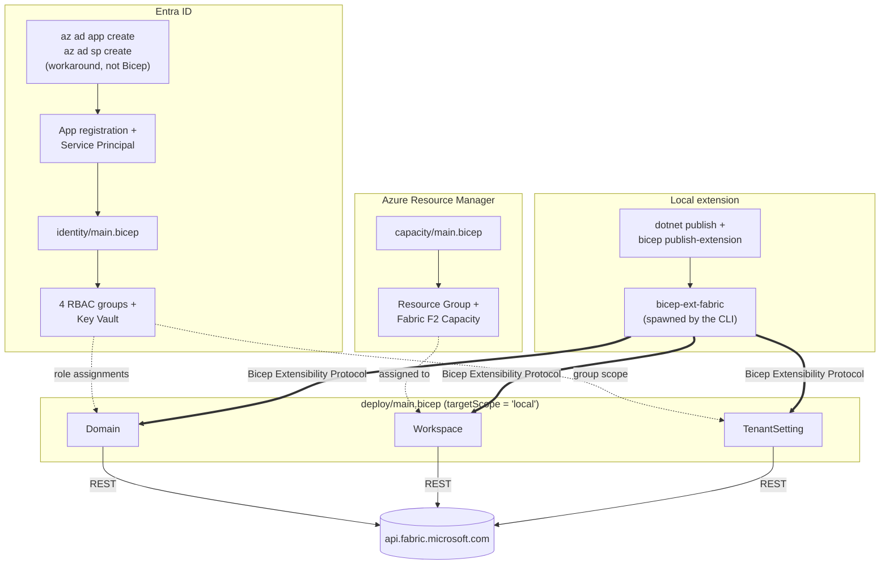

# bicep-fabric-extension

A [Bicep local extension](https://github.com/Azure/bicep/blob/main/docs/experimental/local-deploy-dotnet-quickstart.md) for Microsoft Fabric, covering `Workspace`, `Domain`, and `TenantSetting` resources (`Create`/`Delete`, `Create`/`Update` for the latter), plus the Entra security groups, service principal, Fabric capacity, and Key Vault around it, all declared as Bicep.

Written up in full on the blog: [awood.tech](https://awood.tech).

## Layout

- `capacity/` - Fabric F2 capacity via the [AVM module](https://github.com/Azure/bicep-registry-modules/tree/main/avm/res/fabric/capacity)
- `identity/` - four Entra security groups (one per Fabric workspace role) plus a Key Vault, via the [Microsoft Graph Bicep extension](https://learn.microsoft.com/en-us/graph/templates/bicep/whats-new). Takes the extension's app/service principal object ID as a param rather than creating them, see the note below.
- `extension/` - the local extension itself (.NET, `Azure.Bicep.Local.Extension`), with `Workspace`, `Domain`, and `TenantSetting` resource handlers
- `deploy/` - the `.bicep`/`.bicepparam` that declares domains, nested domains, workspaces (assigned to domains), and tenant settings, all via the extension
- `scripts/` - `get-tenant-settings.ps1`, which dumps the tenant's live settings (optionally as a ready-to-paste `param tenantSettings = [...]` block) so the param file can be seeded from what the tenant actually has rather than hand-transcribed

## Architecture

Three deployment surfaces (ARM, Entra, the local extension process) feeding into one Fabric tenant, plus the one workaround (Entra ID) that doesn't go through Bicep at all:



The double arrows are the whole point of this repo: `bicep local-deploy` doesn't hand `Domain`/`Workspace`/`TenantSetting` to Azure Resource Manager at all. It spawns `bicep-ext-fabric` as a real process on whatever machine ran the command, talks to it over the Bicep Extensibility Protocol, and that process makes the actual HTTPS calls to `api.fabric.microsoft.com` itself. Every other box in this diagram is a normal ARM or Graph resource; these three aren't, which is the gap this whole lab exists to close.

## A known Graph extension limitation (fixed upstream as of the last check)

**Update:** re-tested this immediately before publishing, against the same Bicep CLI and extension versions below, and it's fixed, `appId`/`id` are readable again, no workaround needed. Leaving this section as-is since the workaround is still what `identity/main.bicep` actually does today (re-plumbing it back to pure Bicep hasn't been done yet), but if you're starting fresh, try creating `fabricExtApp`/`fabricExtSp` directly in Bicep first, it might just work now.

The Microsoft Graph Bicep extension's ARM-side handler for `Microsoft.Graph/applications` used to not expose `appId` or `id` back out at all, not as a cross-resource reference, not even as a plain output on the same resource:

```
The language expression property 'appId' doesn't exist,
available properties are 'uniqueName, displayName, owners'.
```

That rules out creating the app registration and service principal via Bicep if you need their IDs for anything downstream, which you always do. The workaround used here: create them with plain `az ad app create` / `az ad sp create`, and pass the resulting object IDs into `identity/main.bicep` as parameters (`spObjectId`) instead. Everything else, the four RBAC groups, the Key Vault, the role assignment, stays declarative.

## Running it

Requires .NET 10 SDK and Bicep CLI 0.44.1+.

```bash
# One-time: app registration + service principal (see "A known Graph extension limitation" above)
az ad app create --display-name "bicep-fabric-local-ext-lab"
az ad sp create --id <appId-from-above>
az ad app credential reset --id <appId-from-above> --display-name "bicep-local-deploy-lab"

cd identity
bicep build main.bicep --outfile main.json   # sidesteps az CLI's own (newer, currently incompatible) embedded Bicep compiler
az deployment group create --resource-group <rg> --template-file main.json \
  --parameters labAdminObjectId=<your-object-id> spObjectId=<sp-object-id-from-above>

cd ../extension
dotnet publish --configuration release -r win-x64 .
bicep publish-extension --bin-win-x64 ./bin/release/net10.0/win-x64/publish/bicep-ext-fabric.exe --target ./bin/bicep-ext-fabric --force

cd ../deploy
$env:FABRIC_TENANT_ID = "..."
$env:FABRIC_CLIENT_ID = "..."       # the appId from above
$env:FABRIC_CLIENT_SECRET = "..."   # the password from credential reset
bicep local-deploy main.bicepparam
```

The service principal needs to be allow-listed against several Fabric tenant settings first: "Service principals can create workspaces..." and "Service principals can call Fabric public APIs" for `Workspace`, plus "Service principals can access read-only admin APIs" and "...admin APIs used for updates" for `Domain` and `TenantSetting` (the latter two have to be granted by a human/delegated token first, a service principal can't grant itself admin API access). See the blog post for the full setup, including gotchas around capacity-level Contributor permissions, a stale security group that silently blocked admin API access, and a few Bicep language quirks (self-referencing resource loops, a ternary over resource-array indices that doesn't behave the way the docs say it should, and the `.?` safe-dereference operator).

### Managing tenant settings

`deploy/main.bicep` takes a `tenantSettings` array, so any number of settings can be declared rather than the single one this started with. Each entry is `{ name, enabled, enabledSecurityGroups?, excludedSecurityGroups?, delegateToWorkspace? }`.

Two things make this fiddlier than it looks:

**The name is the API's technical name, not the portal's display title**, and they don't match — the portal's "Service principals can use Fabric APIs" is `ServicePrincipalAccessGlobalAPIs`. Guessing doesn't work. Dump the live list instead:

```powershell
cd scripts
./get-tenant-settings.ps1 -Filter '*ServicePrincipal*'          # browse
./get-tenant-settings.ps1 -AsBicepParam -EnabledOnly            # emit a paste-ready param block
```

That reads `GET /v1/admin/tenantsettings` as whoever's logged into `az login`, so run it as a Fabric Administrator — a scoped-down identity quietly returns a shorter list rather than failing.

**The optional properties aren't valid on every setting.** `enabledSecurityGroups`/`excludedSecurityGroups` only apply where `canSpecifySecurityGroups` is true, and `delegateToWorkspace` only where the setting is delegatable; the update endpoint rejects them elsewhere. The extension builds its request body as a dictionary and omits anything left unset, so *omit the key entirely* rather than passing an empty array or `false` — those are real values and get sent. `-AsBicepParam` already emits only the properties each setting supports.

Failures now surface the API's response body rather than a bare status code, since a 400 here almost always names the property it objected to.

### Running as yourself instead of the service principal

For local iteration, `extension/FabricAuth.cs` falls back to `AzureCliCredential` (from `Azure.Identity`) whenever `FABRIC_CLIENT_ID`/`FABRIC_CLIENT_SECRET`/`FABRIC_TENANT_ID` aren't set, reusing whatever's already logged in via `az login`. Skip the `$env:FABRIC_*` block above and just make sure you're logged in:

```bash
az login
cd deploy
bicep local-deploy main.bicepparam
```

This runs as your own identity rather than the SP, so none of the tenant-setting allow-listing above is needed if you're already a Fabric Administrator, useful for quickly iterating on the extension itself. It's not a substitute for testing the actual least-privilege SP story this lab is about, just a faster inner loop. The fallback is silent by design: an unset or typo'd `FABRIC_CLIENT_ID`/`SECRET`/`TENANT_ID` doesn't error, it just authenticates as whatever's logged into `az cli` instead, which could be a surprise on a shared machine.

If you run this way with `adminObjectId` set to your own object ID (the natural setup, granting yourself workspace admin), the workspace creates fine but the explicit admin-role grant used to 409 since you're already Admin from creating it, and that exception aborted before domain assignment ever ran. Fixed in `WorkspaceHandler.cs`: a 409 on that specific call is now treated as already-satisfied rather than a failure. Tested end to end via this exact path before this note was written.

`bicep local-deploy` has no state file, so retrying a failed or partial deployment can create duplicate domains/workspaces rather than being idempotent. Fabric domains do reject a duplicate display name outright (`409 Conflict`); workspaces don't, so check what already exists before rerunning after a partial failure.
