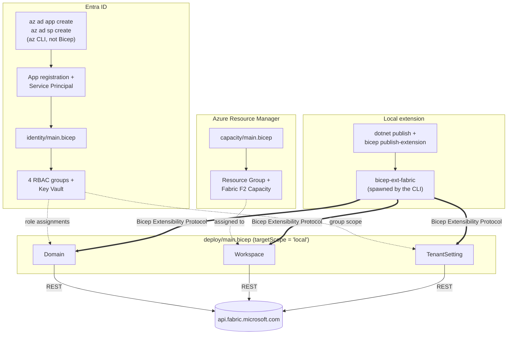

# bicep-fabric-extension

[](https://github.com/Azure/bicep/blob/main/docs/experimental/local-deploy-dotnet-quickstart.md)
[](extension/FabricLocalExtension.csproj)
[](CHANGELOG.md)
[](docs/tenant-settings-guidance.md)

**Manage Microsoft Fabric as infrastructure-as-code.** Workspaces, domains, and all 169 tenant
settings, declared in Bicep and deployed with `bicep local-deploy` — no portal clicking, no
imperative REST scripts.

Fabric has no ARM resource provider for these objects. This repo closes that gap with a [Bicep local
extension](https://github.com/Azure/bicep/blob/main/docs/experimental/local-deploy-dotnet-quickstart.md):
a .NET process that Bicep spawns on your machine and talks to over the Bicep Extensibility Protocol,
which then calls the Fabric REST API directly.

```bicep
targetScope = 'local'
extension fabric

resource domain 'Domain' = {
  displayName: 'dev_domain_fabric'
  adminGroupIds: [ dataStewardsGroupId ]
}

resource ws 'Workspace' = {
  displayName: 'ws-dev-analytics'
  adminObjectId: myObjectId
  domainId: domain.id
}

resource setting 'TenantSetting' = {
  name: 'PublishToWeb'      // anonymous public report exposure
  enabled: false            // ...declared off, and stays off
}
```

> Written up in full on the blog: **[awood.tech](https://awood.tech)**

---

## What's here

| Path | What it does |
| --- | --- |
| **`extension/`** | The local extension itself — .NET 10, `Azure.Bicep.Local.Extension`, with `Workspace`, `Domain`, and `TenantSetting` resource handlers |
| **`deploy/`** | The template declaring domains, nested domains, workspaces (assigned to domains), and tenant settings, all through the extension |
| **`identity/`** | Four Entra security groups (one per Fabric workspace role) plus a Key Vault, via the [Microsoft Graph Bicep extension](https://learn.microsoft.com/en-us/graph/templates/bicep/whats-new) |
| **`capacity/`** | Fabric F2 capacity via the [AVM module](https://github.com/Azure/bicep-registry-modules/tree/main/avm/res/fabric/capacity) |
| **`scripts/`** | `get-tenant-settings.ps1` — dumps the tenant's live settings as a paste-ready `param tenantSettings = [...]` block, with `-Sanitise` for public output |
| **`docs/`** | [**Tenant settings guidance**](docs/tenant-settings-guidance.md) — what all 169 settings do, a preferred posture for each, and why |

## Why bother

Fabric tenant settings are a genuine governance problem: **169 switches, 107 of them scopable to
security groups, defaulting to convenience over security**, and addressed by technical names the
portal never shows you. The portal's "Create workspaces" is the API's `CreateAppWorkspaces`.

Microsoft's [Well-Architected guidance](https://learn.microsoft.com/en-us/azure/well-architected/microsoft-fabric/security)
recommends tracking tenant settings through the admin APIs and comparing them against a baseline to
detect drift. That's exactly what this gives you — the baseline is a Bicep file, and drift is a diff.

## Versioning

[SemVer](https://semver.org/spec/v2.0.0.html), with changes recorded in [CHANGELOG.md](CHANGELOG.md)
per [Keep a Changelog](https://keepachangelog.com/en/1.1.0/). Pre-1.0, so breaking changes can land
in a minor bump — the changelog flags them.

The version is declared once, as `<Version>` in `extension/FabricLocalExtension.csproj`, and read off
the assembly at startup rather than repeated as a literal. Cutting a release means bumping that,
moving the `Unreleased` changelog entries under the new heading, and tagging `vMAJOR.MINOR.PATCH` to
match.

## Architecture

Three deployment surfaces (ARM, Entra, the local extension process) feeding into one Fabric tenant, plus the one step (the app registration) that doesn't go through Bicep at all:



The double arrows are the whole point of this repo: `bicep local-deploy` doesn't hand `Domain`/`Workspace`/`TenantSetting` to Azure Resource Manager at all. It spawns `bicep-ext-fabric` as a real process on whatever machine ran the command, talks to it over the Bicep Extensibility Protocol, and that process makes the actual HTTPS calls to `api.fabric.microsoft.com` itself. Every other box in this diagram is a normal ARM or Graph resource; these three aren't, which is the gap this whole lab exists to close.

## Running it

Requires .NET 10 SDK and Bicep CLI 0.44.1+.

```bash
# One-time: app registration + service principal. Created here rather than in identity/main.bicep,
# which takes the resulting object ID as its spObjectId param. Everything else stays declarative.
az ad app create --display-name "bicep-fabric-local-ext-lab"
az ad sp create --id <appId-from-above>
az ad app credential reset --id <appId-from-above> --display-name "bicep-local-deploy-lab"

cd identity
bicep build main.bicep --outfile main.json   # sidesteps az CLI's own (newer, currently incompatible) embedded Bicep compiler
az deployment group create --resource-group <rg> --template-file main.json \
  --parameters labAdminObjectId=<your-object-id> spObjectId=<sp-object-id-from-above>

cd ../extension
dotnet publish --configuration release -r win-x64 .
bicep publish-extension --bin-win-x64 ./bin/release/net10.0/win-x64/publish/bicep-ext-fabric.exe --target ./bin/bicep-ext-fabric --force

cd ../deploy
$env:FABRIC_TENANT_ID = "..."
$env:FABRIC_CLIENT_ID = "..."       # the appId from above
$env:FABRIC_CLIENT_SECRET = "..."   # the password from credential reset
bicep local-deploy main.bicepparam
```

The service principal needs to be allow-listed against several Fabric tenant settings first: "Service principals can create workspaces..." and "Service principals can call Fabric public APIs" for `Workspace`, plus "Service principals can access read-only admin APIs" and "...admin APIs used for updates" for `Domain` and `TenantSetting` (the latter two have to be granted by a human/delegated token first, a service principal can't grant itself admin API access). See the blog post for the full setup, including gotchas around capacity-level Contributor permissions, a stale security group that silently blocked admin API access, and a few Bicep language quirks (self-referencing resource loops, a ternary over resource-array indices that doesn't behave the way the docs say it should, and the `.?` safe-dereference operator).

### Managing tenant settings

`deploy/main.bicep` takes a `tenantSettings` array, so any number of settings can be declared rather than the single one this started with. Each entry is `{ name, enabled, enabledSecurityGroups?, excludedSecurityGroups?, delegateToWorkspace? }`.

Two things make this fiddlier than it looks:

**The name is the API's technical name, not the portal's display title**, and they don't match — the portal's "Service principals can use Fabric APIs" is `ServicePrincipalAccessGlobalAPIs`. Guessing doesn't work. Dump the live list instead:

```powershell
cd scripts
./get-tenant-settings.ps1 -Filter '*ServicePrincipal*'          # browse
./get-tenant-settings.ps1 -AsBicepParam -EnabledOnly            # emit a paste-ready param block
```

That reads `GET /v1/admin/tenantsettings` as whoever's logged into `az login`, so run it as a Fabric Administrator — a scoped-down identity quietly returns a shorter list rather than failing.

For what each setting actually does and a defensible default for it, see
[**docs/tenant-settings-guidance.md**](docs/tenant-settings-guidance.md) — all 169 settings with a
preferred posture and the reasoning, grounded in the Well-Architected security guidance and the
Microsoft cloud security benchmark baseline.

`deploy/tenant-settings.all.bicepparam` is a checked-in capture of all 169 settings this tenant exposes, as a reference for the names and which properties each one supports. It's generated with `-Sanitise`, so group object IDs are placeholders. Treat it as something to copy entries *out of* into `main.bicepparam` rather than a file to deploy — applying it wholesale asserts all 169 settings, including turning off everything currently off. For a local working copy with real group IDs, regenerate without `-Sanitise` into `main.local.bicepparam`, which is gitignored.

**The optional properties aren't valid on every setting.** `enabledSecurityGroups`/`excludedSecurityGroups` only apply where `canSpecifySecurityGroups` is true, and `delegateToWorkspace` only where the setting is delegatable; the update endpoint rejects them elsewhere. The extension builds its request body as a dictionary and omits anything left unset, so *omit the key entirely* rather than passing an empty array or `false` — those are real values and get sent. `-AsBicepParam` already emits only the properties each setting supports.

Failures now surface the API's response body rather than a bare status code, since a 400 here almost always names the property it objected to.

### Running as yourself instead of the service principal

For local iteration, `extension/FabricAuth.cs` falls back to `AzureCliCredential` (from `Azure.Identity`) whenever `FABRIC_CLIENT_ID`/`FABRIC_CLIENT_SECRET`/`FABRIC_TENANT_ID` aren't set, reusing whatever's already logged in via `az login`. Skip the `$env:FABRIC_*` block above and just make sure you're logged in:

```bash
az login
cd deploy
bicep local-deploy main.bicepparam
```

This runs as your own identity rather than the SP, so none of the tenant-setting allow-listing above is needed if you're already a Fabric Administrator, useful for quickly iterating on the extension itself. It's not a substitute for testing the actual least-privilege SP story this lab is about, just a faster inner loop. The fallback is silent by design: an unset or typo'd `FABRIC_CLIENT_ID`/`SECRET`/`TENANT_ID` doesn't error, it just authenticates as whatever's logged into `az cli` instead, which could be a surprise on a shared machine.

If you run this way with `adminObjectId` set to your own object ID (the natural setup, granting yourself workspace admin), the workspace creates fine but the explicit admin-role grant used to 409 since you're already Admin from creating it, and that exception aborted before domain assignment ever ran. Fixed in `WorkspaceHandler.cs`: a 409 on that specific call is now treated as already-satisfied rather than a failure. Tested end to end via this exact path before this note was written.

`bicep local-deploy` has no state file, so retrying a failed or partial deployment can create duplicate domains/workspaces rather than being idempotent. Fabric domains do reject a duplicate display name outright (`409 Conflict`); workspaces don't, so check what already exists before rerunning after a partial failure.
